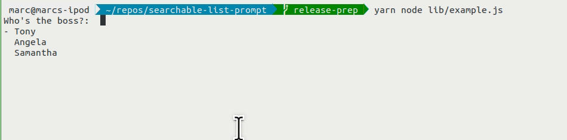

# searchable-list-prompt

A small [Inquirer.js](https://github.com/SBoudrias/Inquirer.js)-based CLI prompt to make searcheable, dynamic lists a bit better. This was largely inspired by shortcomings of existing similar Inquirer plugins, with the aim of making a truly comprehensive and extensible module of my (and hopefully your) list prompt needs.

## Install

```
yarn add https://github.com/mcataford/searchable-list-prompt#main
```

## Usage

```js
import searchableListPrompt from 'searcheable-list-prompt'

const theChosenOne = await searchableListPrompt({
    message: 'Pick one:',
    choices: ['Luke', 'Anakin', 'Frodo']
})
```



## Features

### Choices

`choices` is a function or an array of items used to populate the prompt's list. It can be a list of __strings__, __numbers__ or __objects__. In the case of object choices, they should have same format as [the `choices` parameter described by Inquirer](https://github.com/SBoudrias/Inquirer.js#objects).

### Page Size

`pageSize` is a number that describes the number of items in the visible window. If the number of choices is greater than the page size, only `pageSize` elements will be rendered on screen and the rest can be access via scrolling. The scrolling wraps around.

### Customizable messaging

#### When no matches exist

You can pass your own "no matches" message as a string via `noMatchesMessage`. The default is otherwise `No matches`.

#### Prompt

You can pass in a message to be displayed before the prompt via `message`

#### Selection marker

You can pass a string via `selectionMarker` that will appear on the left of the choice you are currently on. 
